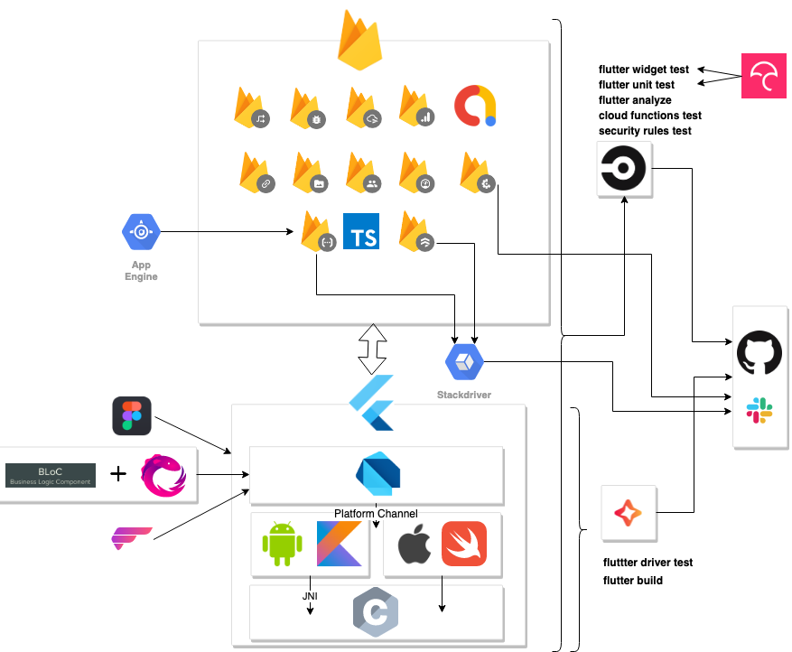
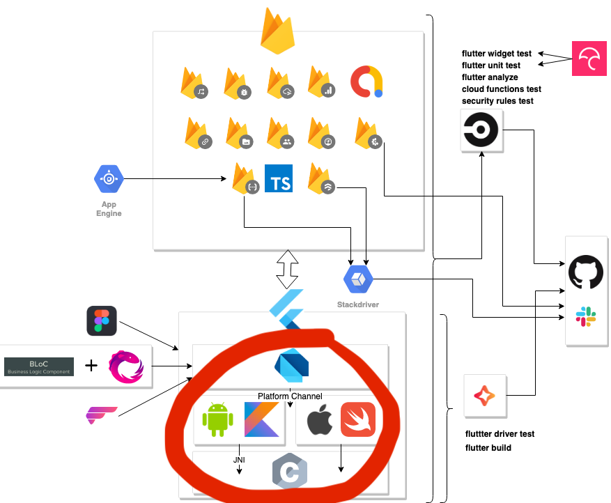
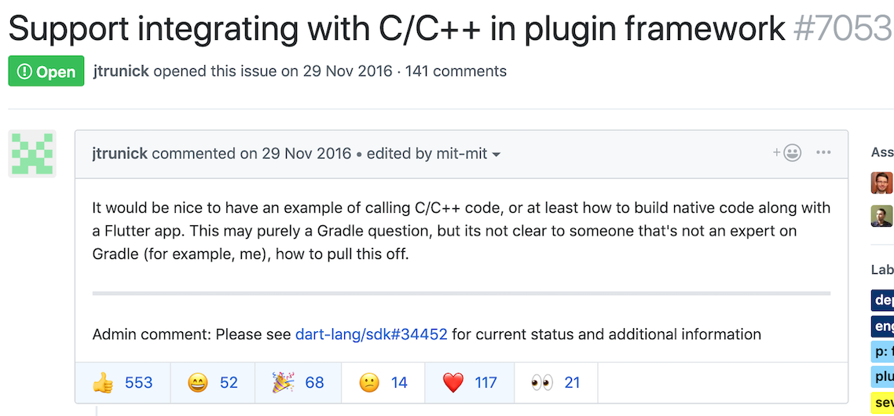
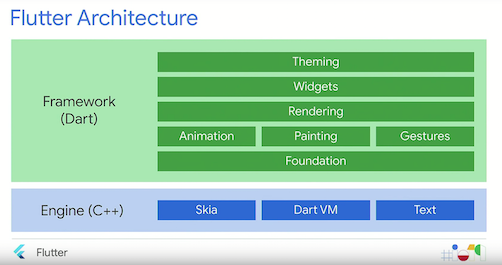
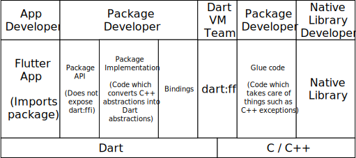

# Flutter/Dart における FFI
<!-- _footer: Flutter Meetup Tokyo #10 ： しみずなおき-->

---
## 今日話すこと
# FFI の実装が進んでいる理由は？

---
## 【 結論 】
# 主にパフォーマンスの観点から、Native Extension より FFI が適しているため
---
# FFI ？
---
<h1>
  <span style="color:red;">F</span>oreign <span style="color:red">f</span>unction <span style="color:red">i</span>nterface</span>
</h1>
<br>

#####  今回は C 呼び出しの話
###### (C -> Dart の話は省きます)
---
# 自己紹介
---
<!-- _header: 自己紹介 -->

## しみず なおき

<br>

<a href="https://github.com/sensuikan1973" target="_blank"></i></a>

---
<!-- _header: 自己紹介 -->


---
<!-- _header: 自己紹介 -->
# お家で作ってるモノ
---


---
<!-- _header: 自己紹介 -->
# オセロには常に C が必要
---
<!-- _header: 自己紹介 -->


---
<!-- _header: 前置き -->
# 各言語の C 呼び出し
---
<!-- _header: 前置き -->
### 代表的なもの
| 言語 | 実装方法 |
| :-----: | :-----: |
| Java | <div style="text-align:left">[JNI](https://docs.oracle.com/javase/jp/8/docs/technotes/guides/jni/spec/jniTOC.html) や [JNA](https://github.com/java-native-access/jna), [SWIG](http://www.swig.org/) を使う</div> |
| Go | <div style="text-align:left">[cgo](https://golang.org/cmd/cgo/) を使う</div> |
| Python | <div style="text-align:left">[ctypes](https://docs.python.org/3/library/ctypes.html) や [cffi](https://cffi.readthedocs.io/en/latest/) を使う</div> |
| Rust | <div style="text-align:left">[extern キーワード](https://doc.rust-lang.org/book/ch19-01-unsafe-rust.html#using-extern-functions-to-call-external-code)で容易に呼べる</div>|
| Ruby | <div style="text-align:left">[Ruby-FFI](https://github.com/ffi/ffi) を使う</div> |
| Javascript | <div style="text-align:left">[WebAssembly](https://developer.mozilla.org/ja/docs/WebAssembly/C_to_wasm) を使う</div> |
| Swift | <div style="text-align:left">[そのままいける](https://developer.apple.com/documentation/swift/imported_c_and_objective-c_apis/using_imported_c_functions_in_swift)し、[カスタム](https://developer.apple.com/documentation/swift/objective-c_and_c_code_customization/customizing_your_c_code_for_swift)も可能 </div> |

---
# Dart は？
---
# Dart から C を呼ぶ方法 <br> (これまで)
---
<!-- _header: FFI の実装が進んでいる背景 > Dart から C を呼ぶ方法 (これまで) -->
# Native Extension
---
<!-- _header: FFI の実装が進んでいる背景 > Dart から C を呼ぶ方法 (これまで) -->
<!-- _class: default -->
#### Dart 側
<br>

<div style="font-size:35px;">

```dart
library sample_hello;
import 'dart-ext:sample_hello';
void hello() native "Hello";
```
</div>
<br>

<span style="font-size:30px;">参考: [dart-lang sample_extension](https://github.com/dart-lang/sdk/tree/master/samples/sample_extension)</span>

---
<!-- _header: FFI の実装が進んでいる背景 > Dart から C を呼ぶ方法 (これまで) -->
<!-- _class: default -->
#### C++ 側 <span style="font-size:24px;">(一部省略)</span>
<!--
#include <string.h>
#include <stdlib.h>
#include <stdio.h>
#include "include/dart_api.h"
#include "include/dart_native_api.h"
-->

<div style="font-size:20px;">

```cpp
DART_EXPORT Dart_Handle sample_hello_Init(Dart_Handle parent_library) {
  if (Dart_IsError(parent_library)) return parent_library;
  Dart_Handle result_code = Dart_SetNativeResolver(parent_library, ResolveName, NULL);
  if (Dart_IsError(result_code)) return result_code;
  return Dart_Null();
}

void hello(Dart_NativeArguments arguments) {
  Dart_EnterScope();
  printf("Hello\n");
  Dart_ExitScope();
}

Dart_NativeFunction ResolveName(Dart_Handle name, int argc, bool* auto_setup_scope) {
  if (!Dart_IsString(name) || auto_setup_scope == NULL) return NULL;
  Dart_EnterScope();
  const char *cname;
  Dart_StringToCString(name, &cname);
  Dart_NativeFunction result = NULL;
  if (strcmp(cname, "hello") == 0) result = hello;
  Dart_ExitScope();
  return result;
}
```
</div>

👉 深いレベルで拡張可能

---
<!-- _header: FFI の実装が進んでいる背景 > Dart から C を呼ぶ方法 (これまで) -->
<!-- _class: default -->
#### わかりやすく例をもう一個
```cpp
void isEven(Dart_NativeArguments arguments) {
  Dart_EnterScope();
  Dart_Handle arg1 = Dart_GetNativeArgument(arguments, 0);
  int64_t input;
  if (Dart_IsError(Dart_IntegerToInt64(arg1, &input)))
  {
    Dart_ThrowException(Dart_NewStringFromCString("Error だよ"));
  }
  Dart_SetReturnValue(arguments, Dart_NewBoolean(input % 2 == 0));
  Dart_ExitScope();
}
```
👉 引数と返り値の型情報が静的に定義されていない

---
# さて、Flutter では？
---
<!-- _header: FFI の実装が進んでいる背景 > Flutter から C を呼ぶ方法 -->
# 現状、Swift/Objective-C, Kotlin/Java を経由する必要がある
---
<!-- _header: FFI の実装が進んでいる背景 > Flutter から C を呼ぶ方法 -->


---
<!-- _header: FFI の実装が進んでいる背景 > Flutter から C を呼ぶ方法 -->
# たくさんの 👍 の思いは？
---
<!-- _header: FFI の実装が進んでいる背景 > Flutter から C を呼ぶ方法 -->
# ① 既存ソフトをより統合しやすくしてほしい
---
<!-- _header: FFI の実装が進んでいる背景 > Flutter から C を呼ぶ方法 -->
<!-- _class: default -->
<br>
<br>

# ◯ 大量のグルーコードがつらい

<br>
<br>

# ◯ 低オーバーヘッドがいい
---
<!-- _header: FFI の実装が進んでいる背景 > Flutter から C を呼ぶ方法 -->
## SQLite

## Realm

## OpenCV

## crypto, ssh ... libraries

などが具体例として挙げられている

---
<!-- _header: FFI の実装が進んでいる背景 > Flutter から C を呼ぶ方法 -->
# ② 大量のデータを効率よく出し入れしたい

<br>
<br>

##### なお、Dart 2.4 から [TransferableTypedData](https://api.dartlang.org/stable/2.4.0/dart-isolate/TransferableTypedData-class.html)  が使用できるようになったので、ある程度はそれで間に合いそう

---
# こういう要望にどう応えるか？
---
<!-- _header: FFI の実装が進んでいる背景 > Flutter/Dart における Dart-C をどう実現するか？ -->
# ① C++ でメソッドチャンネルを提供する？
<!-- _footer: (参考: [issues/7053](https://github.com/flutter/flutter/issues/7053#issuecomment-415161464))-->

---
<!-- _header: FFI の実装が進んでいる背景 > Flutter/Dart における Dart->C をどう実現するか？ -->
# 😣
---
<!-- _header: FFI の実装が進んでいる背景 > Flutter/Dart における Dart->C をどう実現するか？ -->
# メソッドチャンネルがオーバーヘッド高いので、目的に合わない
---
<!-- _header: FFI の実装が進んでいる背景 > Flutter/Dart における Dart->C をどう実現するか？ -->
# ② Native Exstention でサポートできるようにする？
---
<!-- _header: FFI の実装が進んでいる背景 > Flutter/Dart における Dart->C をどう実現するか？ -->
# 😣
---
<!-- _header: FFI の実装が進んでいる背景 > Flutter/Dart における Dart->C をどう実現するか？ -->
<!-- _class: default -->
# 【 理由 1 】
# 名前ベースの API

```
// dart-lang/sdk/runtime/include/dart_api.h より引用
DART_EXPORT DART_WARN_UNUSED_RESULT Dart_Handle
Dart_SetField(Dart_Handle container, Dart_Handle name, Dart_Handle value);
```

#### 👉 AOT コンパイラさんには辛い
#### 👉 名前解決がキャッシュされない
---
<!-- _header: FFI の実装が進んでいる背景 > Flutter における Dart->C をどう実現するか？ -->
<!-- _class: default -->
# 【 理由 2 】
# Reflective Marshaling は効率良くない

```cpp
void isEmailAddress(Dart_NativeArguments arguments)
```

`void` `arguments` 👀

#### ⇒ 引数/返り値が静的に型付けされた上での Marshaling の方が効率良い
#### ⇒ その点は FFI が優れている

---
<!-- _header: FFI の実装が進んでいる背景 > Flutter における Dart->C をどう実現するか？ -->
# Flutter/Dart チームが採った方法は？
---
# dart : ffi 👍

<br>
<br>
<br>

###### https://github.com/dart-lang/sdk/tree/master/sdk/lib/ffi

---
<!-- _header: FFI の実装が進んでいる背景 > dart:ffi の始まり -->
## [Google I/O'19](https://www.youtube.com/watch?v=J5DQRPRBiFI) でも言及あり

<b style="text-align:center">

> We are working on a new foreign function interface.
> This should help you reuse existing C and C++ code,
> which is important for some critical stuff
</b>

---
<!-- _header: FFI の実装が進んでいる背景 > dart:ffi の始まり -->
#### ちなみに
> we expect that moving Flutter Engine from C API to FFI should significantly reduce overheads associated with crossing the boundary between Dart and native code
---
<!-- _header: FFI の実装が進んでいる背景 > dart:ffi の始まり -->
# どう使えるのか？
---
<!-- _header: FFI の実装が進んでいる背景 > dart:ffi の始まり -->
<div style="font-size:35px;">

👍

```dart
import "dart:ffi" as ffi;
import 'dart:io' show Platform;

void main() {
  final libHelloWorld = ffi.DynamicLibrary.open(
  	"./libHelloWorld.dylib");
  final helloWorld = libHelloWorld.lookupFunction
  	<ffi.Void Function(), void Function()>("helloWorld");

  helloWorld();
}
```
</div>
<div style="font-size:30px;">

[https://github.com/sensuikan1973/Dart_FFI_Hello_World](https://github.com/sensuikan1973/Dart_FFI_Hello_World)
</div>

---
<!-- _header: FFI の実装が進んでいる背景 > dart:ffi の始まり -->
# そして、先週、、、
---
<!-- _header: FFI の実装が進んでいる背景 > dart:ffi の始まり -->
# Flutter stable 版に preview が!

<br>

#### (Android のみの試験的なもの)
---
<!-- _header: FFI の実装が進んでいる背景 > dart:ffi の始まり -->
# どういう構成になるのか
---
<!-- _header: FFI の実装が進んでいる背景 > dart:ffi の始まり -->


<!-- _footer: ([dart-lang/sdk/samples/ffi/sqlite/docs/sqlite-tutorial.md](https://github.com/dart-lang/sdk/blob/master/samples/ffi/sqlite/docs/sqlite-tutorial.md) より引用) -->

---
# ぜひ [dart:ffi に FB](https://groups.google.com/forum/#!forum/dart-ffi) を送りましょう 👍

<br>
<br>

#### ([課題](https://gist.github.com/mraleph/2582b57737711da40262fad71215d62e#design-sketch) は多いです。Dart VM FFI の進行状況は [ココ](https://github.com/dart-lang/sdk/projects/13))
---
# ありがとうございました
---
<!-- _class: default -->
###### リンク一覧

<div style="font-size: 20px;">

- **[Dart VM FFI Vision](https://gist.github.com/mraleph/2582b57737711da40262fad71215d62e)**
  - **[Introduction to Dart VM](https://mrale.ph/dartvm/)**
  - [Design and implement Dart VM FFI](https://github.com/dart-lang/sdk/issues/34452)
  - [Flutter Support integrating with C/C++ in plugin framework](https://github.com/flutter/flutter/issues/7053)
  - [Native extensions for the standalone Dart VM](https://dart.dev/server/c-interop-native-extensions)
  - [Support for Dart Extensions](https://github.com/flutter/flutter/issues/2396)
- [C & C++ interop using FFI](https://dart.dev/server/c-interop)
  - **[sdk/lib/ffi/](https://github.com/dart-lang/sdk/tree/master/sdk/lib/ffi)**
  - [Dart Native platform ](https://dart.dev/platforms)
  - [dart:ffi sqllite sample](https://github.com/dart-lang/sdk/blob/master/samples/ffi/sqlite/README.md)
- [The Engine architecture](https://github.com/flutter/flutter/wiki/The-Engine-architecture)
  - [Writing custom platform-specific code](https://flutter.io/platform-channels/)
  - [Custom Flutter Engine Embedders](https://github.com/flutter/flutter/wiki/Custom-Flutter-Engine-Embedders)
- [Language features for FFI](https://github.com/dart-lang/language/issues/411)
- [sensuikan1973/flutter-ffi-slide](https://github.com/sensuikan1973/flutter-ffi-slide)
- [sensuikan1973/Dart_FFI_Hello_World](https://github.com/sensuikan1973/Dart_FFI_Hello_World)
</div>
