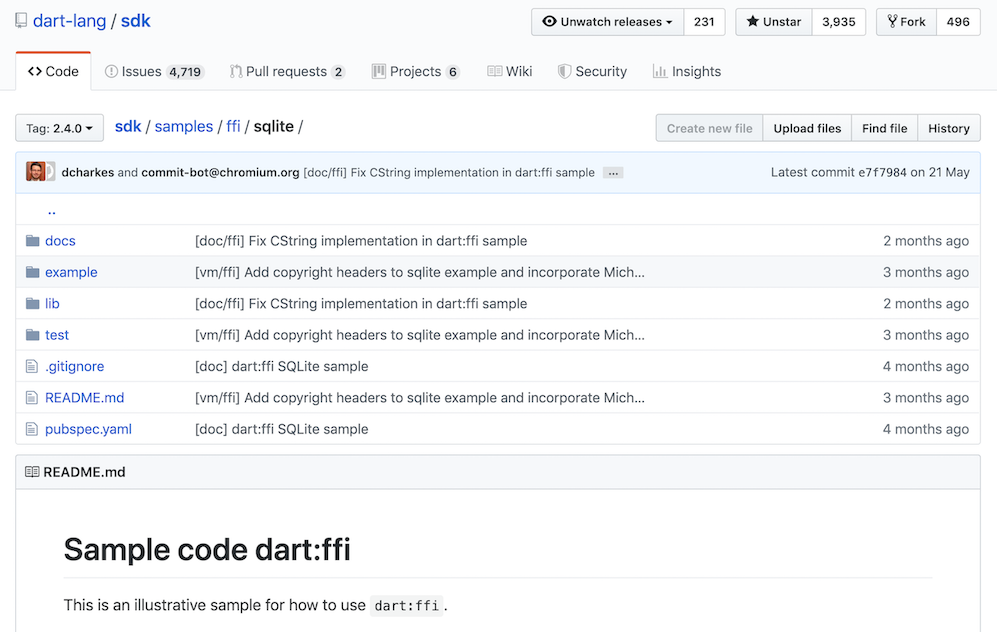

# Flutter における FFI
---
# FFI ？
---
<h1>
  <span style="color:red;">F</span>oreign <span style="color:red">f</span>unction <span style="color:red">i</span>nterface</span>
</h1>

<br>

#####  今回は C++/C の呼び出しの話
---
# 話すこと
---
<h2>
○ Flutter/Dart で FFI どうやるか

○ (Flutter の) FFI は何が難しいか
</h2>

---
# 自己紹介
---

## しみず なおき


---


---
# お家で作ってるモノ
---


---
# オセロには常に C が必要
---


---
# 各言語の C 呼び出し
---
#### 代表的なもの
| 言語 | 実装方法 |
| :-----: | :-----: |
|  C++  | <div style="text-align:left">`extern "C"` で C++ の名前マングリンsグを無効にできる。</div>|
| Java | <div style="text-align:left">[JNI](https://docs.oracle.com/javase/jp/8/docs/technotes/guides/jni/spec/jniTOC.html) や [JNA](https://github.com/java-native-access/jna), [SWIG](http://www.swig.org/) を使う</div> |
| Python | <div style="text-align:left">[ctypes](https://docs.python.org/3/library/ctypes.html) や [cffi](https://cffi.readthedocs.io/en/latest/) を使う</div> |
| Rust | <div style="text-align:left">[extern キーワード](https://doc.rust-lang.org/book/ch19-01-unsafe-rust.html#using-extern-functions-to-call-external-code)で容易に呼べる</div>|
| Ruby | <div style="text-align:left">[Ruby-FFI](https://github.com/ffi/ffi) を使う</div> |
| Javascript | <div style="text-align:left">[WebAssembly](https://developer.mozilla.org/ja/docs/WebAssembly/C_to_wasm) を使う</div> |
| Swift | <div style="text-align:left">[そのままいける](https://developer.apple.com/documentation/swift/imported_c_and_objective-c_apis/using_imported_c_functions_in_swift)し、[カスタム](https://developer.apple.com/documentation/swift/objective-c_and_c_code_customization/customizing_your_c_code_for_swift)も可能 </div> |

---
### 例: Go -> C
<div style="font-size:40px;">

```go
package main

/*
#include <stdlib.h>
#include <stdio.h>

void hello() {
    printf("Hello\n");
}
*/
import "C"

func main() {
    C.hello()
}

```
</div>

---

# Dart は？
---
## [Google I/O'19](https://www.youtube.com/watch?v=J5DQRPRBiFI) でも言及あり

<b style="text-align:center">

> We are working on a new foreign function interface.
> This should help you reuse existing C and C++ code,
> which is important for some critical stuff
</b>

---
<!-- _class: default -->
<br>
<br>

# ① Native Extension

<br>
<br>

# ② dart : ffi
---
# ① Native Extension
---
#### C++ 側
<div style="font-size:30px;">

```cpp
#include <string.h>
#include <stdlib.h>
#include <stdio.h>
#include "include/dart_api.h"
#include "include/dart_native_api.h"

Dart_NativeFunction ResolveName(Dart_Handle name, int argc, bool* auto_setup_scope);

DART_EXPORT Dart_Handle sample_hello_Init(Dart_Handle parent_library) {
  if (Dart_IsError(parent_library)) return parent_library;
  Dart_Handle result_code = Dart_SetNativeResolver(parent_library, ResolveName, NULL);
  if (Dart_IsError(result_code)) return result_code;
  return Dart_Null();
}

void hello(Dart_NativeArguments arguments) {
  Dart_EnterScope();
  printf("Hello\n");
  Dart_ExitScope();
}

Dart_NativeFunction ResolveName(Dart_Handle name, int argc, bool* auto_setup_scope) {
  if (!Dart_IsString(name) || auto_setup_scope == NULL) return NULL;
  Dart_EnterScope();
  const char *cname;
  Dart_StringToCString(name, &cname);
  Dart_NativeFunction result = NULL;
  if (strcmp(cname, "Hello") == 0) result = Hello;
  Dart_ExitScope();
  return result;
}
```
</div>

---
#### Dart 側
<div style="font-size:35px;">

```dart
library sample_hello;
import 'dart-ext:sample_hello';
void hello() native "Hello";
```
</div>
<br>

<span style="font-size:30px;">参考: [dart-lang sample_extension](https://github.com/dart-lang/sdk/tree/master/samples/sample_extension)</span>

---
# ② dart:ffi
---
> The extension mechanism discussed in this page is for deep integration of the VM.
> If you just need to call existing code written in C or C++, see [C & C++ interop using FFI](https://dart.dev/server/c-interop).

<br>
<div style="font-size:25px;text-align:right;">

引用元: [Native extensions for the standalone Dart VM](https://dart.dev/server/c-interop-native-extensions)
</div>

---
<div style="font-size:35px;">

```dart
import "dart:ffi" as ffi;
import 'dart:io' show Platform;

void main() {
  final libHelloWorld = ffi.DynamicLibrary.open(
  	"./libHelloWorld.dylib");
  final helloWorld = libHelloWorld.lookupFunction
  	<ffi.Void Function(), void Function()>("helloWorld");

  helloWorld();
}
```
</div>
<div style="font-size:30px;">

[https://github.com/sensuikan1973/Dart_FFI_Hello_World](https://github.com/sensuikan1973/Dart_FFI_Hello_World)
</div>

---
# さて、Flutter では？
---


---
# たくさんの 👍 の思いは？
---
# ① 既存ソフトをより統合しやすくしてほしい
---
<!-- _class: default -->
<br>
<br>

# ◯ 大量のグルーコードがつらい

<br>
<br>

# ◯ 低オーバーヘッドがいい
---
# SQLite

# Realm

# OpenCV

# crypto, ssh ... libraries
などが具体例として挙げられている

---
# ② 大量のデータを効率よく出し入れしたい
---
## なお、Dart 2.4 から [TransferableTypedData](https://api.dartlang.org/stable/2.4.0/dart-isolate/TransferableTypedData-class.html)  が使用できるようになったので、ある程度はそれで間に合いそう

---
# どうするか？
---
# ① C++ でメソッドチャンネルを提供する？
---
# 😣
---
# メソッドチャンネルがオーバーヘッド高いので、目的に合わない
---
# ② Native Exstention でサポートできるようにする？
---
# 😣
---
<!-- _class: default -->

# 【 理由 1 】
# 名前ベースの API

```
DART_EXPORT DART_WARN_UNUSED_RESULT Dart_Handle
Dart_SetField(Dart_Handle container, Dart_Handle name, Dart_Handle value);
```

#### 👉 AOT に不親切
#### 👉 名前解決がキャッシュされない

[dart-lang/sdk/runtime/include/dart_api.h](https://github.com/dart-lang/sdk/blob/0425997b3167d6d227f337ff85b6fab8744a157f/runtime/include/dart_api.h#L2502) より引用

---
<!-- _class: default -->
# 【 理由 2 】
# Reflective Marshaling は効率良くない

```dart
void isEmailAddress(Dart_NativeArguments arguments)
```

`void` `arguments` 👀 返り値も引数も型は決まってるけど...

#### ⇒ 引数/返り値が静的に型付けされた上での Marshaling の方が良い
#### ⇒ FFI ✌️

---
# Flutter/Dart チームが採った方法は？
---
# dart : ffi 👍
---



---

# 2.4 にて Preview 版提供開始 !

<br>

#### (Flutter/Android での試験的サポートも始まっている)
---


---

そもそも FFI の実装て何が難しいの？

---

Flutter における FFI の展望


---

ありがとうございました

---
<!-- _class: default -->
###### リンク一覧

<div style="font-size: 20px;">

- [Dart VM FFI Vision](https://gist.github.com/mraleph/2582b57737711da40262fad71215d62e)
  - [Design and implement Dart VM FFI](https://github.com/dart-lang/sdk/issues/34452)
  - [Flutter Support integrating with C/C++ in plugin framework](https://github.com/flutter/flutter/issues/7053)
  - [Native extensions for the standalone Dart VM](https://dart.dev/server/c-interop-native-extensions)
  - [Support for Dart Extensions](https://github.com/flutter/flutter/issues/2396) 
- [C & C++ interop using FFI](https://dart.dev/server/c-interop)
  - [Dart Native platform ](https://dart.dev/platforms)
  - [dart:ffi sqllite sample](https://github.com/dart-lang/sdk/blob/master/samples/ffi/sqlite/README.md)
- [The Engine architecture](https://github.com/flutter/flutter/wiki/The-Engine-architecture)
  - [Writing custom platform-specific code](https://flutter.io/platform-channels/)
  - [Custom Flutter Engine Embedders](https://github.com/flutter/flutter/wiki/Custom-Flutter-Engine-Embedders)
- [Language features for FFI](https://github.com/dart-lang/language/issues/411)
- [sensuikan1973/flutter-ffi-slide](https://github.com/sensuikan1973/flutter-ffi-slide)
- [sensuikan1973/Dart_FFI_Hello_World](https://github.com/sensuikan1973/Dart_FFI_Hello_World)
</div>
